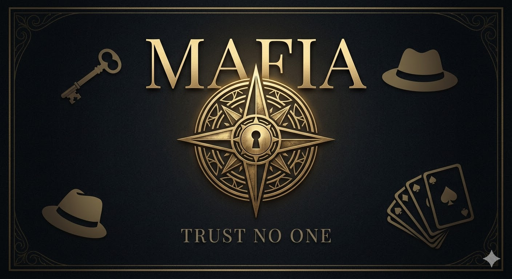

# Mafia
A browser-based Mafia game for 4–16 players. No install required. Bring the world’s most famous game of deception to your browser. This project is a mobile-ready, automated Game Master for Mafia, featuring secret role reveals, hidden detective investigations, and a dynamic debate timer. A special thanks to Hanim for the introduction to this classic. Compatible with any phone, tablet, or laptop.

# Mafia: Digital Narrator

Open. Play. Deceive. 

A sleek, automated Game Master for the classic social deception game. Inspired by Hanim. No install required: just open the link and deal the roles.

## Features
- **Noir Gold Interface:** Premium aesthetic matching the classic theme.
- **Zero Install:** Runs entirely in the mobile or desktop browser.
- **Automated Narration:** Handles night phases, role peeks, and hidden investigations.
- **Dynamic Timer:** Manages town debates with red warning alerts.

## Origins
A special thanks to Hanim for introducing me to this timeless game.

***

A special thanks to **Hanim** for the introduction to this classic. Developed by [FlashSolver].